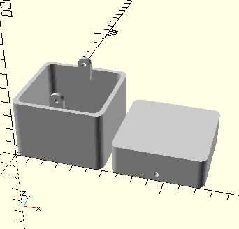

# Edge rounded box with screws

This is a small box with a separate lid and body. These two pieces can be fixed with screws and nuts.

## Dimensions
All dimensions can be adjusted by editing the scad script.
The pre-defined size is:

### Closed box
|Dimension|Value|
|---------|-----|
|X length (width)| 6cm |
|Y length (depth)| 6cm |
|Z length (height)| 6cm |
|Edge radius| 5mm |
|Screw radius| 1.5mm |

### For each piece
|Piece|Height|
|-----|------|
|Top (lid)| 2cm |
|Bottom (body)| 4cm |
