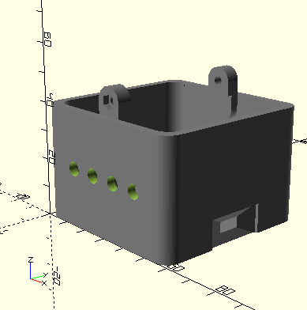

# NodeMCU + Nokia 5110 Box 2
Box to projects with the NodeMCU board and a Nokia 5110 display (with 4 side holes for wires and holes for screw nuts).

### Lid (with the Nokia 5110 display module)

### Body

**STL models have not the Nokia 5110 and NodeMCU models included**

## Links
GrabCAD community: https://grabcad.com/library/box-for-nodemcu-nokia-5110-projects-1

## Dimensions
All dimensions can be adjusted by editing the scad script.
The pre-defined size is:

### Closed box
|Dimension|Value|
|---------|-----|
|X length (width)| 6cm |
|Y length (depth)| 6cm |
|Z length (height)| 6cm |
|Edge radius| 5mm |
|Screw radius| 1.5mm |
|Structure thickness| 3mm |

### For each piece
|Piece|Height|
|-----|------|
|Top (lid)| 2cm |
|Bottom (body)| 4cm |

## Credits
* **Nokia 5110 display model:** https://grabcad.com/library/nokia-5110-display-1
* **NodeMCU module model:** https://grabcad.com/library/esp8266-nodemcu-1
