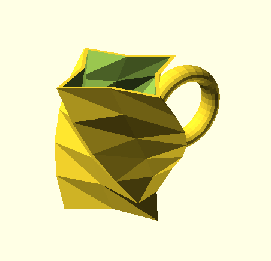
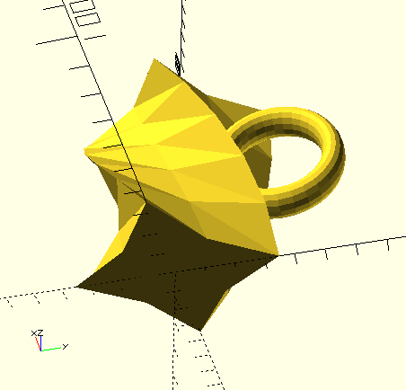
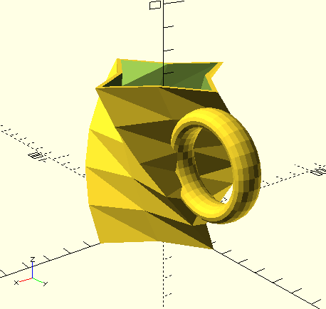
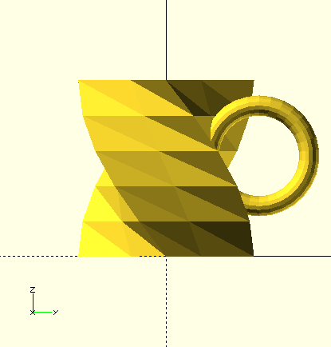
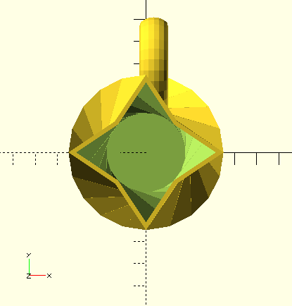
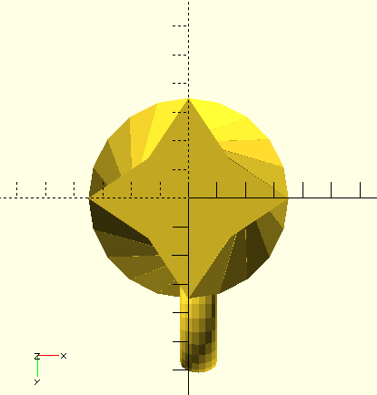
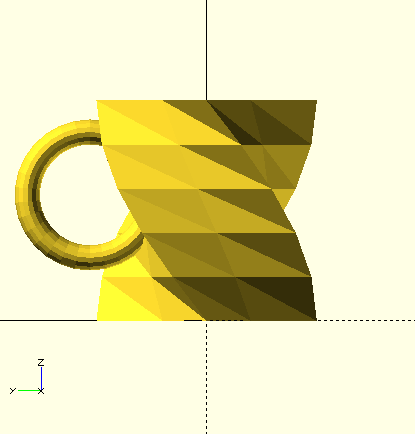

# Snail Mug
By Filipe Chagas

### Perspective views

### Orthogonal views

## Dimensions
|Dimension|Value|
|---------|-----|
|Width (X lenght)| 7cm |
|Depth (Y lenght)| approximately 9.6cm |
|Height (Z lenght)| 7cm |

**Note: The depth (Y length) is greater than the width because of the handle. The mug body has the same length on all the axes.**

**Note 2: This mug is a good table decoration, but I suppose it’s not very comfortable to have a hot drink with that. 😕**

