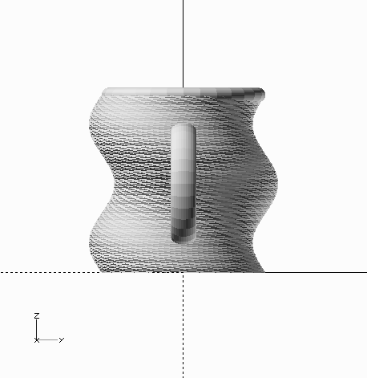

# Snail Mug 2
By Filipe Chagas

### Perspective views

### Orthogonal views

## Dimensions
|Dimension|Value|
|---------|-----|
|Width (X lenght)| approximately 9.5cm |
|Depth (Y lenght)| approximately 7.55cm |
|Height (Z lenght)| approximately 7.3cm |

**Note: The depth (Y length) is greater than the width because of the handle. The mug body has the same length on all the axes.**

**Note 2: This mug is a good table decoration, and it’s much more comfortable for have a hot drink than the first snail_mug. 👍👌**

